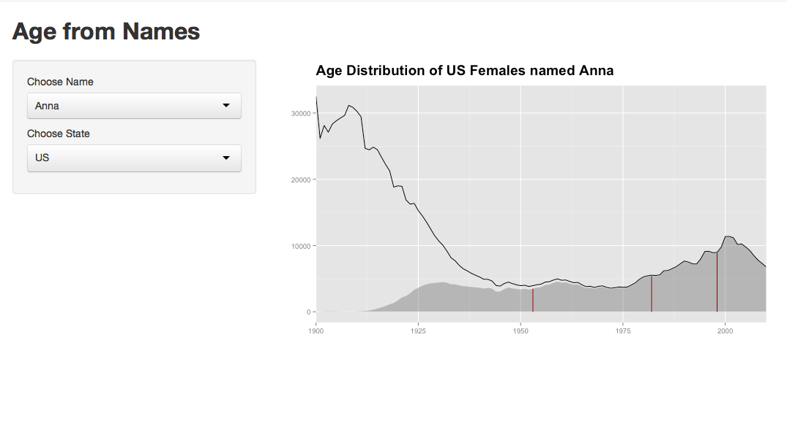

## AgebyName

```{r setup, cache = F, echo = F}
library(knitr)
opts_knit$set(fig.path = 'figures', warning = F, message = F)
```


This R package is inspired by [Nate Silver's](https://twitter.com/FiveThirtyEight) recent article on [How to Tell Someone's Age When All you Know is Her Name](http://fivethirtyeight.com/features/how-to-tell-someones-age-when-all-you-know-is-her-name/). It allows one to (almost) replicate the analysis done in the article, and provides more extensive features.

To get started, you can install the package from github using `devtools`.


```{r eval = F}
library(devtools)
install_github("ramnathv/agebyname")
```


#### Usage

There are two main functions in this package that allow you to carry out interesting analysis. The `plot_name` function allows you to plot the distribution of births by `name`, `sex` and `state`, while the `estimate_age` function provides the age estimate, given the same set of input arguments.

Let us start by plotting the distribution for the name __Joseph__.

```{r}
library(agebyname)
plot_name('Joseph')
```

Since the `sex` argument is not specified, `plot_name` guesses it based on the modal sex for the given name.

One can also plot the distribution for names from a given state. For example, we can plot

```{r}
library(agebyname)
plot_name('Violet', state_ = "MA")
```

Let us now use the `estimate_age` function to plot the age distribution for the 25 most common female names.

```{r}
library(dplyr, warn.conflicts = FALSE)

top_100_names = bnames %>%
  group_by(name, sex) %>%
  summarize(n = sum(n)) %>%
  arrange(desc(n)) %>%
  head(100)

estimates = plyr::ldply(top_100_names$name, estimate_age)

library(ggplot2)
estimates %>%
  left_join(top_100_names) %>%
  filter(sex == "F") %>%
  arrange(desc(n)) %>%
  head(25) %>%
  ggplot(aes(x = reorder(name, -q50), y = q50)) +
    geom_point() +
    geom_linerange(aes(ymin = q25, ymax = q75)) + 
    coord_flip()
```

You can also use this package to generate an interactive Shiny application that allows people to explore the age distribution of names. An example app is available in the package.

```{r eval = F}
app = system.file('example1', package = 'agebyname')
runApp(app)
```




#### Data

This package uses four primary datasets.

1. [Babynames](http://www.ssa.gov/oact/babynames/names.zip)
2. [Babynames by State](http://www.ssa.gov/oact/babynames/state/namesbystate.zip)
3. [Cohort Life Tables](http://www.ssa.gov/oact/NOTES/as120/LifeTables_Tbl_7.html)
4. [Census Live Births Data](http://www.census.gov/statab/hist/02HS0013.xls)

All data was downloaded from the above sources, processed using the R scripts in the `rawdata` folder, and saved as `.rdata` files in the `data` folder. Some extrapolation was done on the raw data to correct for the fact that not all births were recorded by SSA till around 1930, since it wasn't mandatory. Note that there might be some differences in the way I have extrapolated the data, as compared to Nate Silver. If you find any discrepancies in my data cleaning process, please feel free to file an issue or a pull-request.
